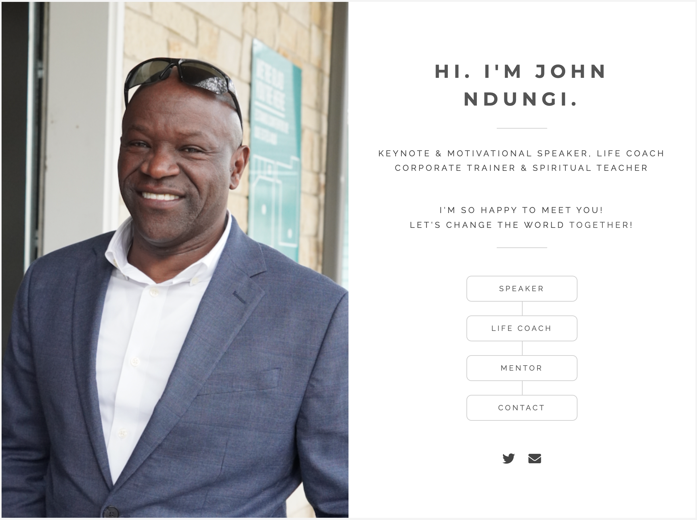
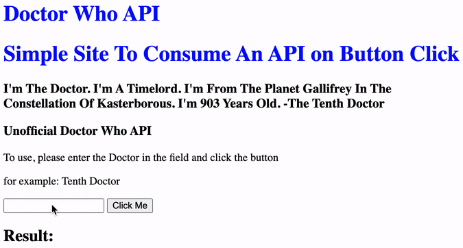
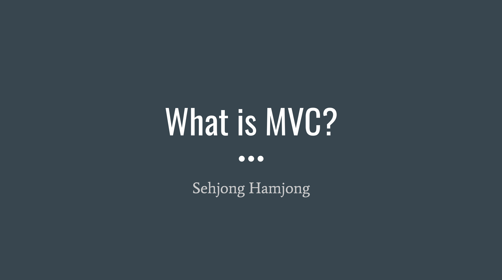

<h1 align="center">Hi 👋, I'm Sehjong</h1>

  
  
  
  

<h3 align="center">I'm a full stack software engineer with a focus in web development. I have a deep interest in AI and a passion for renewable energy. I thrive in collaborative environments and am always eager to contribute to a team. If you're looking for someone with an open mind and an eagerness to collaborate, I'd love to hear from you!</h3>

- 👯 I’m looking to collaborate on **OpenSource Projects**

- 👨‍💻 All of my projects are available at [https://sehjong.me/](https://sehjong.me/)

<h3 align="left">Connect with me:</h3>
<!-- 

 -->

<h3 align="left">Languages and Tools:</h3>

                         

<h1 align="center">Projects</h1>
<table bordercolor="#66b2b2">
  <tr>
    <td width="50%" valign="top">
      <h3 align="center">Poetic Google OAuth2.0 App</h3>
         
        
         
        
 
          
          
        

        
HTML, Handlebars, CSS, Materialize, JavaScript, Node.js, Express.js, MongoDB, Mongoose, Heroku, MVC pattern/architecture

    </td>
    <td width="50%" valign="top">
      <h3 align="center">Client Website</h3>
         
        
         
        
 
          
          
        

        
HTML, SCSS, CSS, JavaScript

    </td>
  </tr>
  
  <tr>
    <td width="50%" valign="top">
      <h3 align="center">Unofficial Doctor Who API</h3>
         
        
         
        
 
          
          
        

        
HTML, CSS, JavaScript, Express.js, Node.js, MongoDB, Heroku

    </td>
    <td width="50%" valign="top">
      <h3 align="center">MVC Lecture</h3>
         
        
         
        

              
        

        
A lecture on MVC pattern/architecture

    </td>
  </tr>  
</table>
